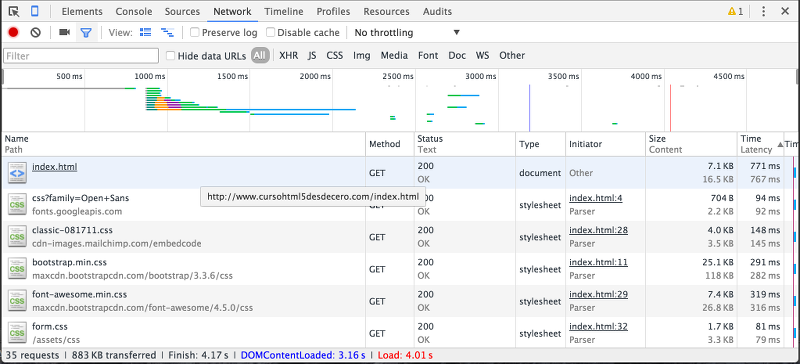
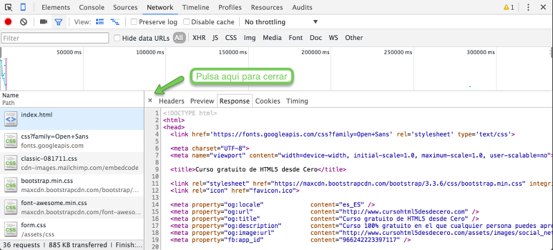
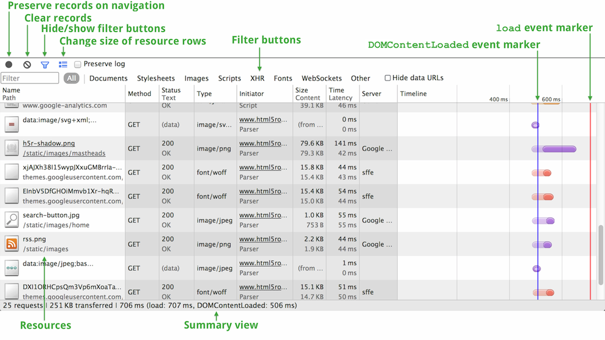

# Pestaña network

Como decíamos, esta pestaña nos permite ver los recursos que solicita el navegador de un servidor usando peticiones HTTP. También nos permite ver los detalles de las mismas: tipo del mensaje (GET/POST), código de respuesta (200, 404, ...), etc1.

Si abres las DevTools después de haber cargado la página, la pestaña "Network" te saldrá vacía, si es así, refresca la página y verás como te aparece algo parecido2 a esto:

Cada fila representa una petición HTTP, y si te fijas, dejando el cursor encima de una petición te mostrará la URL completa del recurso y si pulsamos el botón derecho tendremos varias opciones, entre ellas la de abrir el recurso en una nueva ventana, eliminar los ficheros de la memoria caché, etc. 

> **Nota: ** 
> Podemos vaciar la memoria caché3 de dos formas distintas, una es pulsando el icono de refrescar con el botón derecho, y otra es pulsando el botón derecho sobre cualquiera de las peticiones HTTP y pulsar "Clear browser cache"

Si haces clic en cualquiera de las peticiones podrás ver los contenidos del recurso y algunos detalles que no nos preocuparán en este curso.

Para cerrar el detalle de la petición puedes pulsar en el aspa.

Veamos ahora **algunas**4 de las cosas que podemos hacer en esta pestaña. Si te fijas, las opciones en esta imagen no coinciden exactamente con las de la imagen anterior (y posiblemente tampoco con las tuyas), esto se debe a que este "pantallazo" es de una versión anterior del navegador (no importa), veamos que significan:

* **[Preserve records on navigation](https://developer.chrome.com/devtools/docs/network#preserving-the-network-log-upon-navigation)**: por defecto aparece el bóton en rojo, esto significa que cada vez que cambiemos de página se eliminarán las peticiones y se añadirán las nuevas. En cambio, si lo desactivamos se mantendrán las peticiones antiguas.
* **Preserve log**: si marcas esta opción, el efecto será justo el contrario, nunca se borrarán las peticiones HTTP, ni cambiando de página ni de dominio (se irán añadiendo una tras otra).
* **Clear records**: este botón nos permite limpiar la información de las peticiones.
* **Filter**: nos permite filtrar las peticiones, se buscarán *URLs* que contengan el texto introducido.
* **Hide/show filter buttons**: para ocultar/mostrar los botones para filtar.
* **Filter buttons**: estos botones nos permite ver sólo las peticiones HTTP que ha recuperado un tipo de recurso. *De momento* no lo usaremos mucho.
* **Summary view**: podemos ver cuántas peticiones HTTP se han necesitado para cargar la página (requests), cuando ocupa la suma de todos los recursos recuperados (XXX transferred), el tiempo exacto que ha tardado en descargar los recursos (ms = milisegundos), y en la siguiente lección veremos qué es el DOM y qué significa el DOMContentLoaded.
* **No throttling** (se ve en la imagen anterior): esto permite simular que tu conexión a Intenet es más lenta5. Lo usaremos más adelante cuando queramos ver si nuestra página carga la suficientemente rápido usando un dispositivo conectado por 3G.

Por último y antes de pasar a la siguiente lección, te animo a que dediques un par de minutos a jugar con esta pestaña, y si te surge alguna duda... no olvides preguntarla en los [issues de Github](https://github.com/hhkaos/cursohtml5desdecero/issues).

<small>Aclaraciones:</small> 
<small>1. Es la página de [desarrolladores de Chrome](https://developer.chrome.com/devtools/docs/network#preserving-the-network-log-upon-navigation) puedes consultar que significa cada columna, aunque *no es trivial y no te recomiendo que lo hagas si estás empezando*.</small> 
<small>2. Las peticiones serán distintas en cada página, por lo tanto con casi total seguridad tus peticiones serán distintas a las de la imagen.</small> 
<small>3. Todos los navegadores incluyen una memoria caché temporal para optimizar el tiempo de carga de la página, de este modo el navegador puede reducir el número de peticiones HTTP ([más info](https://developers.google.com/web/fundamentals/performance/optimizing-content-efficiency/http-caching?hl=en)).</small> 
<small>4. Si ya tienes experiencia con Chrome DevTools y quieres, encontrarás dónde ampliar conocimientos en la sección recursos de esta lección.</small>
<small>5. Si ya tienes experiencia con Chrome DevTools y quieres, encontrarás dónde ampliar conocimientos en la sección recursos de esta lección.</small>