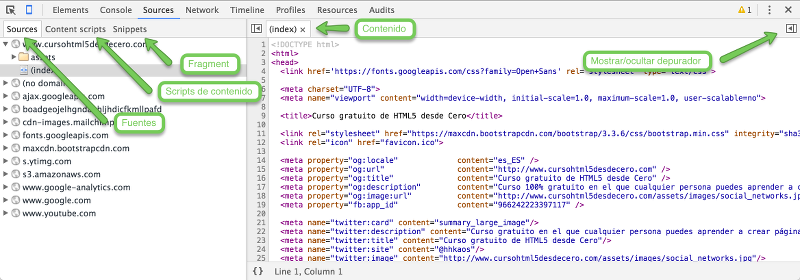

# Pestaña sources

La pestaña "**Sources**" nos muestras las fuentes de contenido que se han utilizado para construir la página. Desde esta pestaña podemos escribir y modificar ficheros que estén vinculados a nuestro disco duro, pero veremos cómo hacer esto en el siguiente apartado.

Empecemos por describir los distintos paneles:

* **Sources**: aquí encontraremos una jerarquía de ficheros por cada dominio desde el cual nuestro navegador hayan obtenido recursos1 HTML, CSS o JavaScript. Haciendo clic en cualquier recurso se abrirá una pestaña en el panel derecho con los contenidos.
* **[Content scripts](https://developer.chrome.com/extensions/content_scripts)**: aquí se encuentran ficheros JavaScript implementados por algunas extensiones de Google Chrome que podamos tener instaladas.
* **[Snippets](https://developers.google.com/web/tools/chrome-devtools/debug/snippets/?hl=en)**: esta pestaña nos permite crear pequeños trozos de código2 JavaScript que podremos ejecutar o reutilizar en cualquier página.
* **Depurador**: este panel nos permite utilizar el depurador de código de JavaScript, veremos como usarlo en posteriores lecciones.

<small>Recursos y aclaraciones:</small> 
<small>1. Normalmente mediante peticiones HTTP aunque puede que también mediante las extensiones de Chrome.</small> 
<small>2. En este repositorio de Github podrás encontrar una [colección de snippers](https://github.com/bgrins/devtools-snippets).</small> 
