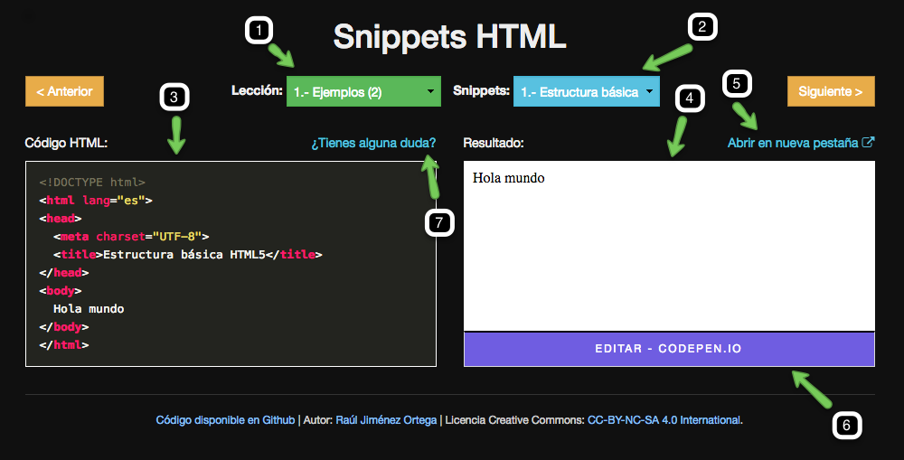

# Introducción a HTML5

HTML ([Hypertext Markup Language](http://www.w3.org/html/)) es un [lenguaje de marcado](https://es.wikipedia.org/wiki/Lenguaje_de_marcado) (*que no es lo mismo que un [lenguaje de programación](https://es.wikipedia.org/wiki/Lenguaje_de_programaci%C3%B3n)*) que sirve para definir la estructura y la semántica de nuestra página web (luego veremos que significa esto). 

HTML fue creado y es mantenido por una organización sin ánimo de lucro llamada [W3C](http://www.w3.org/). El W3C es un consorcio formado por [más de 400 empresas](http://www.w3.org/Consortium/Member/List) (entre ellas las que desarrollan los principales navegadores como Google, Microsoft, Mozilla, Apple...), etc. 

Desde el consorcio trabajan continuamente en definir cómo debe evolucionar este lenguaje y otros estándares que conforman *la web*. Posteriormente los fabricantes de navegadores preparan los mismos intentando conseguir que un código funcione igual en todos los navegadores. Aunque desafortunadamente no siempre es así, cada vez es una realidad más cercana.

Por tanto, [a lo largo de los años las versiones de HTML han evolucionado](https://en.wikipedia.org/wiki/HTML#HTML_versions_timeline): HTML 2.0 (1995), HTML 4.0 (1997), XHTML (2000), **HTML5 (2014)**, etc. con el objetivo de adaptarse a los nuevos tiempos y así dar soporte a nuevas necesidades (estandarización de los sistemas de audio, vídeo, etc).

## Snippets interactivos
Vamos a ver una breve introducción al funcionamiento de la interfaz:

1. Permite navegar entre las diferentes lecciones
2. Permite navegar entre los diferentes snippets
3. Ejemplo de código HTML (con la sintaxis resaltada)
4. Resultado del código (3) en embebido en la página
5. Nos permite abrir la previsualización a pantalla completa
6. Nos permite usar el editor web [Codepen.io](http://codepen.io), un editor bastante popular para experimentar con el código.
7. Enlace a los **issues** de Github donde podremos publicar cualquier duda o problema sobre los ejemplos.

Puedes acceder a esta interfaz a través de la siguiente URL:
[http://libro.cursohtml5desdecero.com/snippets/html/](http://libro.cursohtml5desdecero.com/snippets/html/)
