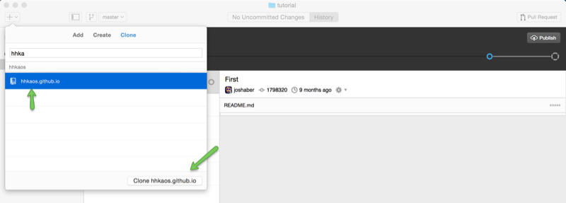

# Enviar y recibir cambios

##Instalar y configurar Github Desktop
Vamos a empezar por descargar, instalar y configurar [Github Desktop](https://desktop.github.com) que es una herramienta que nos va a ayudar a gestionar las versiones de manera gráfica1.
 
Una vez descargado e instalado lo abrimos y nos identificamos con nuestra cuenta.

Una vez hecho volvemos a la opción de clonar y seleccionamos el repositorio que acabamos de crear.

Esto nos pedirá que seleccionamos una carpeta en nuestro disco duro donde se va a clonar el repositorio (se creará una carpeta nueva en nuestro disco duro lista para controlar los cambios). La seleccionamos y le damos a "OK".

Una vez clonada el repositorio vamos a ver una forma básica de usarlo.

## Enviar y recibir cambios

## Ver el histórico de cambios

<small>Aclaraciones:</small> 
<small>1. Mi recomendación una vez te acostumbres a usar Git es que hagas el curso gratuito [Try Git de CodeSchool](https://www.codeschool.com/courses/try-git) para aprender a usar Git desde la línea de comandos, **yo nunca uso ninguna herramienta gráfica**.</small> 