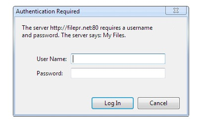

# URLs

Para acceder a un fichero/recurso a través de un navegador usamos la URL (Uniform Resource Locator). Cualquier URL sigue el siguiente formato:

```
scheme:[//[user:password@]host[:port]][/]path[?query][#fragment]
```

**Aclaración**: En informática se suelen utilizan los corchetes **[ ]** para indicar que lo que se encuentra contenido entre ellos es opcional.

Vamos a hacer un pequeño repaso a cada una de las partes de la URL:

* **scheme (obligatorio)**: este suele ser "http" o "https", aunque podría ser también: file, ftp, mailto, data, skype, etc.
* **user:password@**: usuario y contraseña (p.e. hhkaos:mipass@). Esto por ejemplo se utiliza en conexiones FTP o SSH que requieren autentificación. También se puede usar para conectar a sistemas que usen [.htpasswd](https://en.wikipedia.org/wiki/.htpasswd) como en el que se muestra en la siguiente imagen:<br>
* **host**: nombre de dominio (p.e. rauljimenez.info) o dirección IP del servidor web (p.e. 79.82.123.1)
* **port**: [puerto](https://es.wikipedia.org/wiki/Puerto_de_red)<sup>1</sup> (si no se especifica ninguno se usa el 80 por defecto)
* **path (obligatorio)**: ruta al fichero (p.e. blog/index.php)
* **query**: parámetros/variables (p.e. preview=true)
* **fragment**: punto de anclaje (p.e. #introducción)

Así una URL válida podría ser:
```
https://hhkaos.gitbooks.io/introduccion-a-html5/content/chapter1.html#primeros-pasos-con-html5
```
Donde:
- scheme = https
- user:password@ = (vacío)
- host = hhkaos.gitbooks.io
- port = 80
- path = introduccion-a-html5/content/chapter1.html
- query = (vacío)
- fragment = #primeros-pasos-con-html5 

Otro ejemplo de URL válida podría ser: ```file:///Users/hhkaos/index.html```

En este caso estamos le estamos indicando al navegador que acceda a un fichero que se encuentra en nuestro disco duro.

<small>Aclaraciones:</small><br>
<small>1. Los puertos son números enteros que nos permiten especificar a qué "*puerta*" o "*canal*" de una máquina nos queremos conectar. Por ejemplo en la web se suele usar el 80 para los servidores HTTP (aunque Skype también lo usa), el 21 para el FTP, 22 para el SFTP, etc</small><br>