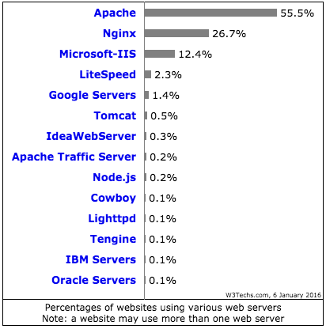

# Alojamiento y servidores HTTP

Para este curso nos vale con entender las siguientes definiciones (informales):
- **[Servidor web HTTP](https://es.wikipedia.org/wiki/Servidor_web)** (o simplemente: *servidor web* o *servidor HTTP*): es programa que se encarga principalmente de las comunicaciones con el navegador1. Envia y recibe mensajes y archivos.
- Un **[alojamiento web](https://es.wikipedia.org/wiki/Alojamiento_web)** (*web hosting* o *hosting*): es un ordenador2 conectado a Internet3 (normalmente 24 horas, 7días a la semana) en el que hay instalado entre otros programas, el servidor HTTP y al que podemos solicitarle recursos. Comúnmente también se le llama: **servidor**.

En este curso usarás tu máquina como servidor mientras estés haciendo pruebas, y posteriomente usarás el hosting gratuito y el servidor HTTP que ofrece Github para entregar los ejercicios.

En el apartado *Peticiones HTTP* veremos en detalle cómo se comunica un servidor que tenga un servidor HTTP instalado con nuestro navegador.

Algunos de los servidores webs y empresas que ofrecen alojamiento web:
* Alojamiento web: 1and1, AWS, Linode, etc. ([ver más](http://hostarting.es/hostings/)) 
* Servidores web: [Apache](http://www.apache.org/), [Nginx](http://nginx.org/) y [IIS](https://www.iis.net/), etc. ([ver más]((https://es.wikipedia.org/wiki/Servidor_web#Software))

 
Fuente: [w3techs - 6 de Enero de 2016](http://w3techs.com/technologies/overview/web_server/all)

<small>Aclaraciones:</small> 
<small>1. No siempre tiene que ser también con un navegador, puede ser con otro tipo de software.</small> 
<small>2. Hay muchos [tipos de hosting](https://es.wikipedia.org/wiki/Alojamiento_web#Tipos_de_alojamiento_web_en_Internet), aunque a nosotros nos vale con esta definición</small> 
<small>3. También podría estar conectado a una [intranet](https://en.wikipedia.org/wiki/Intranet) (o red local)</small>