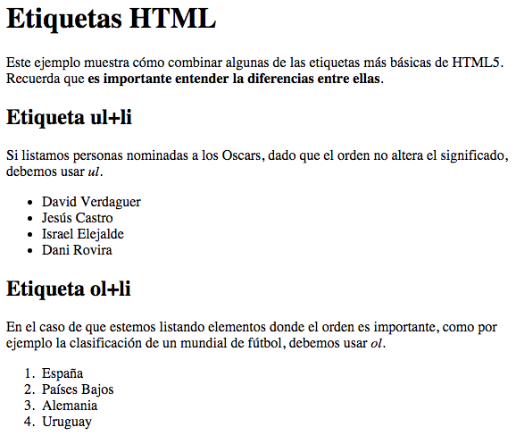

# Etiquetas básicas

Para terminar esta lección vamos a aprender el significado de ocho de las etiquetas que con más frecuencia tendremos que usar cuando creemos páginas web:

* ```<h1></h1>```: esta etiqueta se utiliza para representar el encabezado de una página, como si fuera el índice de un libro. Puede variar desde 1 hasta 6 para diferenciar subniveles ([+info](http://www.w3.org/TR/2014/REC-html5-20141028/sections.html#the-h1,-h2,-h3,-h4,-h5,-and-h6-elements)).

* ```<p></p>```: representa un párrafo ([+info](http://www.w3.org/TR/2014/REC-html5-20141028/grouping-content.html#the-p-element)).

* ```<br>```: representa un salto de línea ([+ìnfo](http://www.w3.org/TR/2014/REC-html5-20141028/grouping-content.html#the-p-element)).

* ```<ul></ul>```: representa una lista de elementos, donde el orden de los elementos no es importante - esto quiere decir que el cambio del orden no modifica el significado. ([+ìnfo](http://www.w3.org/TR/2014/REC-html5-20141028/grouping-content.html#the-ul-element)).

* ```<ol></ol>```: representa una lista de elementos, donde el orden de los elementos sí es importante - esto quiere decir que el cambio del orden modifica el significado. ([+ìnfo](http://www.w3.org/TR/2014/REC-html5-20141028/grouping-content.html#the-ol-element)).

* ```<li></li>```: representa un elemento de la lista y su padre siempre tiene que ser una etiqueta *ol* o *ul*. ([+ìnfo](http://www.w3.org/TR/2014/REC-html5-20141028/grouping-content.html#the-li-element)).

* ```<strong></strong>```: representa algo muy importante, serio (para avisos o precauciones) o urgente (que debe ser leído antes). ([+ìnfo](http://www.w3.org/TR/2014/REC-html5-20141028/text-level-semantics.html#the-strong-element)).

* ```<em></em>```: sirve para enfatizar en el contenido. ([+ìnfo](http://www.w3.org/TR/2014/REC-html5-20141028/text-level-semantics.html#the-em-element)).

* ```<!-- -->```: se utiliza para añadir comentarios dentro del código que el usuario no podrá ver. Por ejemplo para añadir notas de tareas pendientes, aclaraciones que nos ayuden a nosotros o a otras personas a entender el código, etc.  ([+ìnfo](http://www.w3.org/TR/2014/REC-html5-20141028/syntax.html#comments)).


**Truco**: Para que recuerdes mejor qué significa cada elemento, las etiquetas piensa en los acrónimos en inglés:
* h1 = **h**eading**1**; h2 = **h**eading **2**; ...
* p = **p**aragraph
* br = **b**reak **l**ine
* ul = **u**nordered **l**ist
* ol = **o**rdered **l**ist
* li = **l**ist **i**tem
* em = **em**phasis


El siguiente ejemplo muestra una página web que combina todas ellas:

```html
<!DOCTYPE html>
<!-- TODO: añadir la etiqueta lang -->
<html>
<head>
	<meta charset="UTF-8">
	<title>Ejemplo con etiquetas básicas</title>
</head>
<body>
    <h1>Etiquetas HTML</h1>
    <p>
        Este ejemplo muestra cómo combinar algunas de las etiquetas más básicas de HTML5. <br>
        Recuerda que <strong>es importante entender la diferencias entre ellas</strong>.
    </p>
    
    <h2>Etiqueta ul+li</h2>
    <p>
        Si listamos personas nominadas a los Oscars, dado que el orden no altera el significado, debemos usar <em>ul</em>. 
    </p>
    <ul>
        <li>David Verdaguer</li>
        <li>Jesús Castro</li>
        <li>Israel Elejalde</li>
        <li>Dani Rovira</li>
    </ul>
    
    <h2>Etiqueta ol+li</h2>
    <p>
        En el caso de que estemos listando elementos donde el orden es importante, como por ejemplo la clasificación de un mundial de fútbol, debemos usar <em>ol</em>.
    </p>
    <ol>	 
        <li>España</li>
        <li>Países Bajos</li>
        <li>Alemania</li>
        <li>Uruguay</li>
    </ol>
</body>
</html>
```

Esto generaría una página como la siguiente:
<hr>

<hr>
Si quieres puedes ver [el ejemplo en vivo aquí](https://hhkaos.gitbooks.io/introduccion-a-html5/content/leccion2/ejemplo_con_etiquetas_basicas.html).

Es importante destacar que aunque el navegador le añade un estilo (CSS) por defecto a las etiquetas, por ejemplo:
* ```h1``` y ```h2``` una fuente mayor y negrita
* ```strong```en negrita
* ```ul``` y ```ol``` con un margen a la izquierda y un punto o número respectivamente
* ```em``` en cursiva

Esto no es responsabilidad del HTML, esto lo podremos personalizar en un futuro con CSS. Así que insisto, recuerda que HTML **sólo sirve** para dotar de estructura y darle un valor semántico al contenido, y por tanto **lo importante es entender que: lo que estamos haciendo es darle un valor semántico al mismo**.

Este valor semántico es **muy importante** entre otras cosas para por ejemplo:
* Que los buscadores (que no son más que programas automatizados) puedan "entender" el contenido de nuestra página y así poder detectar de qué estamos hablando y qué es importante.
* Para que otras herramientas como por ejemplo los navegadores para invidentes (p.e. [WebbIE](http://www.webbie.org.uk/es/)) que lo que hacen es leer el contenido al usuario u otros [navegadores basados en texto](https://es.wikipedia.org/wiki/Navegador_web#Navegadores_web_basados_en_texto).